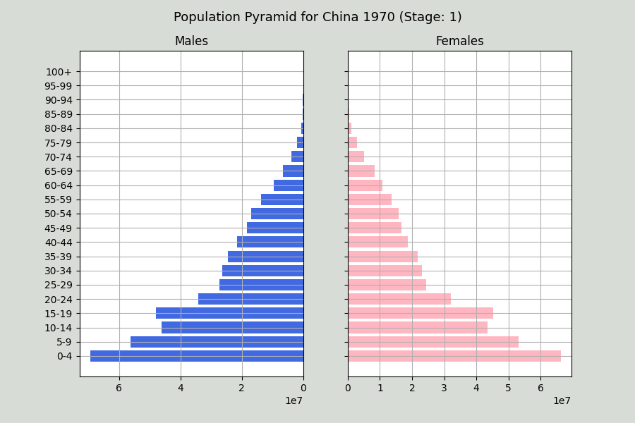
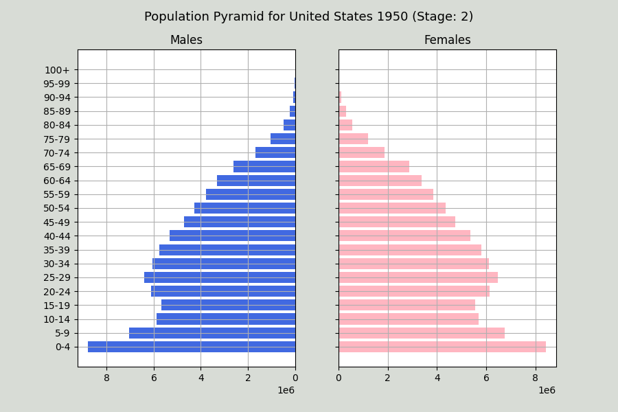
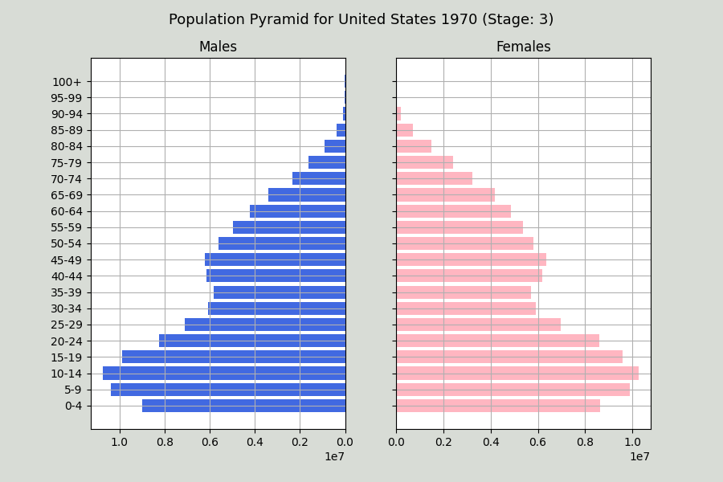
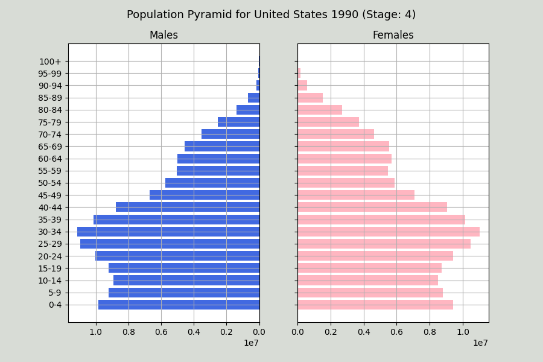

# BoilerMake 2022 Hackathon

A simple app that focuses on classifying the stage of the demographic transition model (DTM) for a particular country.

## Table of Contents
- [Purpose](#purpose)
- [Project Overview](#project-overview)
- [Technologies and Librarties Used](#technologies-and-libraries-used)
- [Setup](#setup)
- [Repository Structure](#repository-structure)
- [Usage](#usage)
- [Resources](#resources)
- [Video Presentation](#video-presentation)
- [Contributors](#contributors)

## Purpose
This project was created during the BoilerMake Hackathon in 2022 held at Purdue University, West Lafayette. It was created to learn more about the demographic transition model and how it can be used to predict the future of a country. We wanted to create a tool that can be used by students and researchers to learn more about demographic models. We hope to expand this project in the future to include more countries and more data. We created something that would be visually appealing and easy to use.

## Project Overview
This project focuses on classifying the stage of the demographic transition model (DTM) for a particular country. The DTM focuses on historical population trends of two demographic variables: the birth rate and death rate. These two variables play a role in the economic and human development within a country. 

Specifically, there are four stages that each country will go through. 

  - Stage 1 (Pre-industrial stage)

    - Applies to most of the world before the Industrial Revolution. Can be identified by a high birth rate and high mortality rate.

    <kbd></kbd>

  
 
  - Stage 2 (Transition stage)
  
    - Introduction of modern technology lowers the mortality rate but still keeps the birth rate high

    <kbd></kbd>

 
    
  - Stage 3 (Industrial stage)

    - Birth rates gradually decrease as a result of improved economic conditions, increase in women's status, and access to contraceptives. This causes the birth rate to also go down.

    <kbd></kbd>

 

  - Stage 4 (Post-industrial stage)
  
    - Birth rates and death rates are low which stabilizes the population. These countries tend to have stronger economies, better healthcare, and a high proportion of working women. This stage consists of mainly developed countries. 

    <kbd></kbd>

 
    

Classifying these stages can provide a lot of detail on how a country is going to develop in the future. We hope to provide this project as an educational and research tool that leads us into a brighter future. For example, many interdisciplinary classes go over this topic and this project can help students visualize DTM so that they can progress in their fields and make a positive difference.
 

*As a trial for our project, we decided to do a case study for five countries (USA, China, UK, India, and Russia). We hope to improve our technology by expanding the domain of countries.*

## Technologies and Libraries Used
- Programming Language
  - Python
- Libraries
  - csv
  - requests
  - plotly
  - pandas
  - numpy 
  - sklearn
  - string
  - tkinter
  - ttkthemes
  - tkinter.scrolledtext
  - matplotlib
  - datapane
  - ipywidgets
  - IPython.display
  

## Setup
Make sure to git clone this repository. After cloning, make sure the latest version of Python and all mentioned packages are installed and the project is ready for use!

## Repository Structure
This repository contains the following files:
- ClasifyStage.py
  - This file contains the code for the classification of the stage of the demographic transition model.
- mathplot.py
  - This file contains the code for the graphing of the data.
- Dropdowngui.py
  - This file contains the code for the Graphical User Interface of the project.

## Usage
To run the program, run the Dropdowngui.py file. This will open up the GUI. To use the application, follow the steps shown in the video presentation.

## Resources

https://www.populationpyramid.net/

https://populationeducation.org/what-demographic-transition-model/

## Video Presentation

https://youtu.be/M-KCBHvYIas

## Contributors 
- Manas Bommakanti
- Aryan Jain
- Roshan Raj
- Shrinivas Venkatesan
